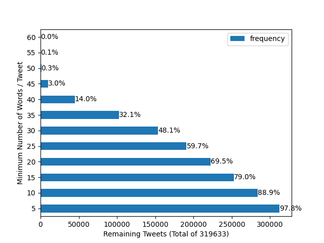
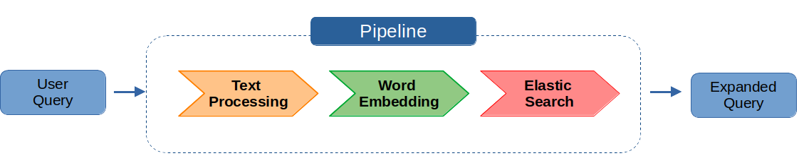

**_Twitter Query Expansion Pipeline_**

Modifying an initial user query by enriching it with suitable expansion terms. At first, pre-processing the user's query with [SpaCy](https://spacy.io/) and looking for similar words by applying different word embedding models such as _FastText_  and _Word2Vec_. Possible expansion terms are then investigated and consequently combined with the initial query. Finally, [Elastic Search](https://www.elastic.co/elasticsearch/) (ES) is  utilized to find relevant tweets given the reformulated user query.

**_Outline_**

[[_TOC_]]

# Structure
- **Pipeline** - The Pipeline is located in the `pipeline` module folder, which contains the three main components i.e. [text_processor.py](), [embedding.py]() and [elasticsearch.py](). Custom tokenizer and matcher for SpaCy's text processing are listed under `pipeline/tokenizer` and `pipeline/matcher` respectively. 

- **Authentication** - Running the Pipeline requires access to a PostgreSQL database and an Elastic Search Index. Specify the respective credentials in the files under `auth/pg-credentials.ini` and `auth/es-credentials.ini`.

- **Models** - The Word Embeddings are listed in the `models` directory. Downloaded embeddings must be listed here.
 
- **Templates** - Have a look into the `templates` folder to inspect the files for generating an Elastic Search Index and search queries. 

- **Output** - Within the `output` folder all results are collected. When running the Pipeline, parameters and retrieved Tweets are stored in a folder with the name of the embedding and the subfolder with the execution date.

- **Scripts** - In the `scripts` folder all executable files for working with this package are contained. The [model_loader.py]() downloads a specified *Word2Vec* or *Fasttext* model and converts it into the expected format. For parsing Tweets from a PostgreSQL database into an ElasticSearch Index, the [tweet_feeder.py]() is utilized. The script [pipeline.py]() handles the invocation of the full pipeline. 

- **Demo** - In the root directory a [demo.ipynb]() file is provided which demonstrates the use of the Pipeline. This includes downloading the embedding models as well as executing the Pipeline and describing different parameters. It is referred to this file for detailed information.  


# Setup
First of all clone the present repository to your local machine.
```sh
git clone https://git-dbs.ifi.uni-heidelberg.de/practicals/2022-jason-pyanowski
```

This project uses [pipenv](https://pipenv.pypa.io/en/latest/#install-pipenv-today). The required python version and packages are listed within the [Pipfile](). Make sure it is installed and run the following command in the root of this project to collect all dependencies.

```sh
pipenv install
```


# 1. Project Description
Between the users' intention and the action to achieve its goal lays a big gap. This is especially problematic if a user wants to obtain information which requires to formulate a query. One can imagine, that different persons describe the same thing differently - so called _Vocabulary Mismatch problem_. Although users state what they are searching for, the initial query is mostly insufficient due to the short length and the lack of relevant keywords. Additionally, the query might contain synonyms, acronyms and homonyms or even emoticons, slang and spelling errors. Understanding the actual meaning of the terms in order to find suitable expansions is therefore a big challenge. 

In the context of micro-blogs like Twitter, a certain amount of special problems occur. First of all, Tweets are often short (limited to 280 characters) and thus matching the present terms is difficult. In the internet itself, many different abbreviations and uncommon language is used which changes at a rapid pace making it an even bigger challenge. However, one can make use of special syntax like hashtags, verified users, Retweets, likes and followers to optimize the Tweet retrieval. 

Selecting the right parts of the initial user query in order to find suitable expansions highly depends on understanding the context and the overall structure of the query. Identifying entities, part of speech and Twitter syntax are a good starting point. Based on this information, Word Embeddings can be applied to find terms that might occur often together with the initial query. It can be expected that these terms increase the overall precision and recall when retrieving Tweets.


## 1.1 Objectives
The overall goal is therefore to implement Query Expansion to enrich a user's initial query with additional terms in order to find relevant tweets that represent the user's intent. The focus is thereby laid on different word embedding models such as Fasttext[^1] and Word2Vec[^2]. To obtain Tweets, an Elastic Search Index is used and specific search patterns specified.

The underlying approach aims at providing a structural and extensible pipeline. Extensible in terms of allowing different word embedding models to be plugged in. Structural in the sense of configuring the pipeline to use different parts of a query for query expansion. 


# 2. Data
The Pipeline requires a collection of Tweets and an arbitrary word embedding model. The employed Twitter data and embeddings are stated below and described briefly.

## 2.1 Twitter Dataset
The Twitter data collection was provided by the [Database Systems Research Group](https://dbs.ifi.uni-heidelberg.de/). It contains about 300,000 german Tweets over a period of about two years related to politics. Initially, this data set is provided in form of a [PostgresSQL](https://www.postgresql.org/) database. The respective scheme is displayed in Figure 2.1. Of particular interest are the Tweets itself and their respective hashtags, user names and named entities.

2.1 Twitter Database ER-Diagram | 2.2 Word Count statistic
:---:|:---:
| | 


To search Tweets performantly, an [Elastic Search](https://www.elastic.co/elasticsearch/) Index is fed with data from the PostgreSQL database. The Indexing is configured by the [es-config.tpl]() template. Tokenization is applied and each token is split at `[ -.,;:!?/#]`. Consequently, the following filters are applied to the obtained tokens:

- **Tweet syntax marker**
To identify Twitter-specific symbols like `#`, `@` and `RT` (Retweet)
- **Length Filter**
To keep words with some length between `[2,...,20]` 
- **ASCII folding**
Converts non-acsii characters into valid ascii characters
- **Lowercase**
- **Decimal digits**
Converts non-decimal numbers into decimal system
- **Stop-word removal**
- **Normalization**
For example replaces `ä` with `a`
- **N-Grams**
Generates n-grams of size `[3,...,8]` 
Especially good for compound words in german language
- **Word stemming**
Use only the root form of a term
- **Unique**
Keep only unique tokens 

To stream Tweets from PostgreSQL to an Elastic Search Index, use the provided script [tweet_feeder.py](). The credentials must be specified within the `auth` folder. You can also choose the minimum number of words for Tweets to include. This directly affects the amount of parsed Tweets and can be investigated in Figure 2.2. Make sure to have access to a database and a running Elastic Search Cluster and execute
```sh
python3 scripts/tweet_feeder.py
```
```sh
usage: tweet_feeder.py [-h] -i INDEX -t TABLE [-ec ELASTIC_CREDENTIALS]
                       [-pc POSTGRES_CREDENTIALS] [-es ELASTIC_SETTINGS]
                       [-wc WORDCOUNT]

Feed Postgres data into Elastic Search Index

options:
  -h, --help            show this help message and exit
  -i INDEX, --Index INDEX
                        Name of Elastic Search Index
  -t TABLE, --table TABLE
                        Name of Postgres table
  -ec ELASTIC_CREDENTIALS, --elastic_credentials ELASTIC_CREDENTIALS
                        Path to Elastic Search credentials file
  -pc POSTGRES_CREDENTIALS, --postgres_credentials POSTGRES_CREDENTIALS
                        Path to Postgres credentials file
  -es ELASTIC_SETTINGS, --elastic_settings ELASTIC_SETTINGS
                        Template for new Index (es-config.tpl)
  -wc WORDCOUNT, --wordcount WORDCOUNT
                        Minimum number of words per Tweet
```
An example Tweet within the resulting Index looks as follows:

```yaml
{
    "retweet_count": 30,
    "reply_count": 0,
    "like_count": 0,
    "created_at": "2021-09-01T15:04:20+02:00",
    "txt": "RT @THWLeitung: Seit sieben Wochen ist das #THW im Einsatz, um die Folgen der #Flutkatastrophe zu beseitigen. Dabei sind die Fähigkeiten aller THW-Fachgruppen gefordert. Bisher haben die 13.566 Einsatzkräfte des THW 1.530.000 Einsatzstunden geleistet. Foto: Kai-Uwe Wärner https://t.co/3N7xqdFb21",
    "hashtags": [
        "flutkatastrophe",
        "thw"
    ],
    "word_count": 38
}
```
## 2.2 Word Embedding Models
For the purpose of finding similar terms, word embeddings are utilized. These models are trained on a large corpus of german text data and allow to describe terms in form of multidimensional vectors. The two following models are evaluated regarding this project:

- **Word2Vec:** [German Word2Vec Model](https://devmount.github.io/GermanWordEmbeddings/) 
- **Fasttext:** [German Fasttext Model](https://fasttext.cc/docs/en/crawl-vectors.html) 

This Fasttext model is trained on Common Crawl and Wikipedia data. The dimension of the vector space is 300 which results in a fairly large model of about 4.5 GB. The Word2Vec model is small in comparison since it only provides the word vectors. It is trained on german wikipedia data and news articles.

To reduce memory consumption the models are post-processed (see [model_loader.py]()). Each models vectors are compressed by using the L2-norm, reducing the size significantly. However, the drawbacks are that the model can not be used for training anymore, out of vocabulary words are no longer available and the overall performance is slightly decreased.


# 3. Pipeline
In order to find relevant Tweets within a large collection, it is useful to expand the initial user query with suitable terms. Therefore, a structural approach is provided - a configurable pipeline. This pipeline handles the expansion of the user query by firstly processing the initial query terms by the component [Text Processor](#31-text-processing). It outputs a list of tokens with specific properties. Based on these information and the underlying configuration it is determined which tokens are used to find similar terms. 

The selected terms are fed into the word embedding models. The component [Word Embedding](#32-word-embedding) handles the process of retrieving $`n`$ possible expansion terms for each selected term. The pipeline allows to download and process arbitrary pre-trained Word Embeddings. 

To determine, if a possible expansion term is suitable, the component [Elastic Search](#33-elastic-search) receives the previously computed terms. By looking at the co-occurrences of the initial term and the expansion term, the most appropriate expansions are chosen. Finally, the query is executed and the Top $`k`$ Tweets returned.

Depending on the objective, it is possible to configure the terms that should be replaced based on Natural Language properties and is further described in the following subsections and explicitly shown in the [demo.ipynb](). The overall structure of the Pipeline is displayed below in Figure 3.1.
<p align="center">
  
</p>
<div align="center"><i>Figure 3.1 Query Expansion Pipeline</i></div>
</br>

## 3.1 Text Processing
The initial query is processed using [SpaCy](https://spacy.io/). This first part of the pipeline includes the following steps:
- **Tokenize text**
- **Split compound hashtags**
- **Remove stop-words**
- **Detect entities**
- **Determine Part-of-Speech (POS) tags**
- **Mark hashtags**
- **Mark Twitter users**

The output of this processing step is a _SpaCy_ document which consist of tokens. Based on the configurations in Table 3.1, only certain tokens are parsed to the subsequent embedding models in order to detect similar terms. It can be decided which _POS tags_ or _entities_ are used to find synonyms. Please refer to SpaCy's [Linguistic Features](https://spacy.io/usage/linguistic-features) for further information concerning tags and entities. Since _hashtags_ and _user_ mentions are a crucial information in Tweets, it can be chosen if they are expanded as well.

| Parameter | Possible Values | Datatype |
|---|---|---|
|POS Tags|`['ADJ', 'ADP', 'ADV', 'AUX', 'CCONJ', 'CONJ', 'DET', 'EOL', 'IDS', 'INTJ', 'NAMES', 'NOUN', 'NO_TAG', 'NUM', 'PART', 'PRON', 'PROPN', 'PUNCT', 'SCONJ', 'SPACE', 'SYM', 'VERB', 'X']`| `list[str]`|
|Entities|`['LOC', 'MISC', 'ORG', 'PER']`|`list[str]`|
|Hashtag|`True, False`|`bool`|
|User|`True, False`|`bool`|
_Table 3.1 Configuration of the Pipeline_


## 3.2 Word Embedding
For finding suitable expansions, different word embedding models can be applied. In the scope of this project, the models described in Section [2.2 Word Embedding Models](#22-word-embedding-models) were used.

In order to determine the $`n \in \mathbb{N}`$ most similar terms based on some input, the vector representation of terms within the word embeddings is utilized. The similarity between the initial query term $`x \in X`$ and another term within the embedding model $`y \in Y`$ is determined using the cosine similarity[^3] of their vector representation $`\mathbf{x}, \mathbf{y} \in \mathbb{R}^N`$ respectively. The similarity can then be computed as

```math
SIM_{cos}(\mathbf{x},\mathbf{y}) = \frac{\mathbf{x} \cdot \mathbf{y}}{\lVert \mathbf{x} \rVert \lVert \mathbf{y} \rVert}
```

For each term $`\mathbf{x}`$ the $`n`$ most similar terms $`Y_{c} : \{\mathbf{y_0}, \dots, \mathbf{y_{n-1}}\} \in Y`$ are returned - so called _candidate terms_. For each of them it must hold

```math
Y_c = \{ {\mathbf{y_i} \mid SIM(\mathbf{x},\mathbf{y_i}) \text{ is among the top $n$ highest values} \}}
```

Now, these candidates can be investigated further if they can act as an expansion. The next pipeline component Elastic Search handles this crucial task. The overall configuration of the component is stated in Table Y. 

| Parameter | Possible Values | Datatype |
|---|---|---|
|Model|`'word2vec', 'fasttext'`|`str`|
|Model Path| `'path to model'`|`str`|
|Number of Similar Terms|`1...N`|`int`|
<div><i>Table 3.2 Configuration of the Pipeline</i></div>
</br>


## 3.3 Elastic Search
The candidate terms $`Y_{c}`$ - obtained by the word embeddings - are ranked based on the Tweet Collection. In order to decide if a found candidate can act as an expansion, the Point-wise Mutual Information[^4] (PMI) measure is applied. Therefore, Elastic Search [Adjacency Matrix Aggregations](https://www.elastic.co/guide/en/elasticsearch/reference/current/search-aggregations-bucket-adjacency-matrix-aggregation.html) determine the number of co-occurrences $`N_{x,y}`$ of the initial term $`x`$ and the candidate term $`y \in Y_{c}`$ and their separate occurrence across the whole document collection $`N_x`$, $`N_y`$. The total number of words $`N`$ is collected by aggregating the `word_count` attribute of each Tweet. Thus, the probabilities can be computed as
```math
P(x,y) = \frac{N_{x,y}}{N},
P(x) = \frac{N_x}{N},
P(y) = \frac{N_y}{N},
```
and inserted into the formula for 
```math
PMI(x,y) = log_2 \left( \frac{P(x,y)}{P(x)P(y)} \right).
```
The PMI is then normalized by the factor $`-log_2(P(x,y))`$ to scale the values between zero and one which results in
```math
PMI_{norm}(x,y) = \frac{PMI(x,y)}{-log_2(P(x,y))}.
```
If a similar term's $`PMI_{norm}`$ exceeds some threshold $`\tau \in \mathbb{R}`$ it is added as expansion term. These terms are then combined with the terms of the initial user query. Finally, the Top $`k`$ Tweets are retrieved. The provided search pattern [es-query.tpl]() is filled with the extracted data and the corresponding Elastic Search Index is scanned. 

---

# 4. Results
Since the intention of the user is not known, it is difficult to judge which expansion terms are appropriate. For the following investigations, the parameters listed in Table 4.1 are applied. They state, that terms that are either an adjective, noun, proper noun or verb are used to find expansions. Locations, organizations and hashtags are included as well. Expanding on users is not supported yet. A total of five candidate terms per query term are obtained during the pipeline execution.

It is examined how the initial user query differs from the expanded query in Section 4.1. In the following section 4.2 it is further investigated where these expansion terms originate from. In particular, how certain parts of the user query (entities, verbs, nouns, ...) affect the expansion generation. Then, Top 3 Tweets for an example query are shown and analyzed in Section 4.3. Finally, in Section 4.4, the two embedding models _Fasttext_ and _Word2Vec_ are compared  based on their ability to generate useful candidate terms.

| Parameter | Value |
|---|---|
|POS Tags|`['ADJ', 'NOUN', 'PROPN', 'VERB']`|
|Entity Types|`['LOC', 'ORG']`|
|Hashtag|`True`|
|User|`False`|
|Number most similar terms|`5`|
_Table 4.1 Parameters used to run Query Expansion Pipeline_

## 4.1 Investigate Expansion Terms
Below, five different initial user queries and the corresponding expansion terms for Fasttext and Word2Vec embeddings are displayed. This particular Fasttext model gives overall more expansions for the given queries compared to Word2Vec. However, the expansions proposed from Word2Vec are mostly a subset from the Fasttext models terms. 

|| Initial User Quey | Fasttext Expansions | Word2Vec Expansions |
|---|---|---|---|
1|_"große Koalition gescheitert unter Merkel? #Groko #SPD #CDU"_ | `[Kanzlerin, Bundeskanzlerin, GroKo, SPD, AFD, CDU, FDP, CSU, Linkspartei]` | `[Bundeskanzlerin, CDU, FDP, SPD]`
2|_"Lauterbach Deutschland Corona-Maßnahmen #Impfung"_ | `[Bundesrepublik, impfung, Schutzimpfung]` | `[Impfschutz, Schutzimpfung]`
3|_"@bundestag Bundestagswahl 2021 Ergebnisse"_ | `[Endergebnis, Ergebniss, Gesamtergebnis, Zwischenergebnis]` | `[Zwichshenergebnis]`
4|_"Gesetzliche Rentenversicherung Rente Mit 67"_ | `[]` | `[Pflegeversicherung]`
5|_"Bundeswehr Afghanistan Krieg stoppen"_ | `[bundeswehr, Bundeswehrverwaltung, Kriegs, Pakistan, Hindukusch]` | `[Hindukusch]`

_Table 4.2 Several initial user queries with resulting expansion terms from Fasttext and Word2Vec model_


## 4.2 Effects of Structural Procedure
In order to get some insight on which expansion terms originate from which terms of the initial user query, it is investigated how the structural approach affects the resulting expansions. The whole pipeline is configurable - this means that it can be adjusted which part of the query is expanded. The following Table shows which parts of the query lead to which expansion terms.

| Query Terms | Noun | Verb | Adjective | Proper Noun | Location | Organization | Hashtag | 
|:---|---|---|---|---|---|---|---|
|`[große, Koalition, gescheitert, Merkel, #Groko, #SPD, #CDU]`||||`[Kanzlerin, Bundeskanzlerin]`| | |`[GroKo, SPD, AFD, CDU, FDP, CSU, Linkspartei]`|
|`[Lauterbach, Deutschland, Corona-Maßnahmen, #Impfung}`|| | |`[Bundesrepublik]`|`[Bundesrepublik]`| |`[impfung, Schutzimpfung]`|
|`[Bundestagswahl, Ergebnisse]`|`[Endergebnis, Ergebniss, Gesamtergebnis, Zwischenergebnis]`| | | | | | | |
|`[Gesetzliche, Rentenversicherung, Rente]`| | | | | | | | |
|`[Bundeswehr, Afghanistan, Krieg, stoppen]`|`[bundeswehr, Bundeswehrverwaltung, Kriegs]`| | |`[Pakistan, Hindukusch]` |`[Pakistan, Hindukusch]` | `[bundeswehr, Bundeswehrverwaltung]`| | 

_4.3. Overview on how different parts of the initial query affect the expansion term generation_

It can be seen, that for verbs and adjectives no expansions were found. This might be explained by the fact, that their co-occurrences are not signifikant enough within the (rather short) Tweets. However, especially nouns and proper nouns (proper names) are expanded on. Hashtags allow to obtain expansions as well. Their usefulness however, can be debated on. Locations and organizations result in expansions as well. How useful these expansion terms are overall is still hard to tell. 

## 4.3 Resulting Tweets
How do the resulting Tweets differ for the initial and the expanded user query? To get an intuition, the Top 3 Tweets obtained for the first query of Table 4.2 are listed below in Table 4.4.


| Rank | Tweets from Initial Query | Tweets from Expanded Query | 
|:---:|---|---|
|1|Die #GroKo #SPD #CDU #CSU will kein #Löschmoratorium zur Sicherung von Akten, sie will keinen Untersuchungsausschuss, sondern eine Enquete zum Desaster in #Afghanistan -  niemand übernimmt Verantwortung und parlamentarische Aufklärung wird blockiert. Das ist die Lage.|Die erste #GroKo in Deutschland vereinte 1966 noch 86,9% der Wähler:innen hinter sich. Das lässt sich heute nicht mal mit einer Mosambik-Koalition erreichen. Aber wenn man #CDU und #FDP einerseits und #SPD und #Grüne anderseits beobachtet, könnte man das glatt als Lösung sehen.|
|2|#SPD und #CDU sind sich bis zur Unkenntlichkeit ähnlich geworden und natürlich wäre eine Neuauflage der #GroKo die bequemste Koa von allen. Kann man nur zuverlässig verhindern, wenn #CSU + + #SPD + #CDU keine eigene Mehrheit bekommen. #triell|6. Als @GrueneBundestag haben wir die Aufklärung im Untersuchungsausschuss #Breitscheidplatz gegen massive Widerstände der #Bundesregierung und #GroKo #CDU #CSU #SPD maßgeblich vorangetrieben. Hier eine Bilanz: https://t.co/Y8fb7v6oa8|
|3|Wenn die Partei des Versagens beim Glasfaserausbau #CDU auf #Digitalisierung macht, und die #Kohlepartei #SPD plötzlich vorgibt,  #KlimaSchutz betreiben zu wollen, weißt Du, die #GroKo erzählt 3 Wochen vor der #btw21 alles mögliche, um an der Macht zu bleiben.|Aber…. Ach so, das wollten ja #SPD #CDU und #CSU explizit nicht. Obwohl Grüne, FDP und Linke das beantragt hatten. Die #GroKo nimmt es schlicht billigend in Kauf, dass bis zu 300 Abgeordnete mehr in den Bundestag kommen. Es wäre schlicht verheerend.|

_Table 4.4 Comparison of retrieved Tweets with respect to the initial and the expanded query_


## 4.4 Comparison of Fasttext and Word2Vec
Eventually, it is interesting which terms the two embeddings propose before the measure of PMI is applied to filter suitable expansions. For each query in Table 4.2, the respective tokens (after Text Processing) are displayed in the Table 4.5. In the left outer column the _possible_ expansion terms (candidate terms) from the Word2Vec and in the right outer column of the Fasttext embedding are stated. A total of the 3 most similar terms were obtained using the configuration of the pipeline stated in Table 4.1.


|Word2Vec Candidates|Query Token|Fasttext Candidates|
|---:|:---:|:---|
`[]` <br> `[Grosse_Koalition,Grossen_Koalition,Regierungskoalition]` <br> `[gescheitert,scheitert,platzen]` <br> `[Kanzlerin_Merkel,Merkel_CDU,Bundeskanzlerin]` <br> `[]` <br> `[CDU,FDP,Gruenen]` <br> `[SPD,FDP,FWG]`|`groß` <br> `Koalition`<br> `scheitern`<br> `Merkel`<br> `Groko`<br> `SPD`<br> `CDU`|`[riesengroß,gross,klein]` <br>`[Regierungskoalition,Koalitionsrunde,Koalitionspartei]` <br> `[scheitert,gescheitert,scheiterten]`<br> `[Kanzlerin,Merkels,Bundeskanzlerin]`<br> `[GROKO,Groko,SPD]` <br> `[CDU,FDP,CDU]` <br> `[SPD,FDP,CSU]`
`[Alsfeld,Buedingen,Hardt]`<br>`[Europa,Oesterreich,hierzulande]`<br>`[Masernimpfung,Impfschutz,Schutzimpfung]`|`Lauterbach` <br> `Deutschland`<br> `Impfung`|`[Lauterbachs,Lauterbach-Schlitz,Reichenbach]` <br> `[Österreich,Europa,Bundesrepublik]` <br> `[Impfungen,impfung,Schutzimpfung]` 
`[Bundestagswahlen,Bundestagwahl,Landtagswahl]`<br>`[Resultat,Zwischenergebnis,Ergebnissen]`|`Bundestagswahl` <br> `Ergebnis` | `[Bundestagswahlen,Landtagswahl,Bundestagwahl]` <br> `[Resultat,Endergebnis,Ergebniss]`
`[gesetzliche,gesetzlichen,tarifvertraglichen]`<br>`[Pflegeversicherung,Krankenversicherung,gesetzliche_Krankenversicherung}`<br> `[Renten,gesetzliche_Rente,gesetzliche_Rentenversicherung]`|`Gesetzliche` <br> `Rentenversicherung` <br> `Rente`| `[gesetzliche,Rechtliche,Vertragliche]` <br> `[Rentenversicherungen,Rentenversicherer,Rentenversicherungsanstalt]` <br> `[Altersrente,Renten,Rentenbeiträge]`
`[Bundeswehr_Afghanistan,Auslandseinsaetze,Bundeswehrsoldaten]`<br>`[Hindukusch,Somalia,Irak]`<br>`[Buergerkrieg,Kriege,Kriegs]`<br>`[bremsen,aufzuhalten,gestoppt]`|`Bundeswehr`<br> `Afghanistan` <br> `Krieg`<br> `stoppen`| `[Bundeswehreinheiten,bundeswehr,Bundeswehr-Kasernen]` <br> `[Irak,Pakistan,Afghanistans]` <br> `[Kriege,Krieges,Bürgerkrieg]` <br> `[unterbinden,verhindern,aufzuhalten]` |

_Table 4.5 Comparison of candidate terms (before term selection) from Word2Vec and Fasttext embedding_

# 5. Conclusion
## 5.1 Limitations
- model vectors, no OOV
- no synonyms

## 5.2 Outlook
- include named entities
- news articles

# References
[^1]: P. Bojanowski, E. Grave, A. Joulin, and T. Mikolov, “Enriching Word Vectors with Subword Information,” 2016, doi: 10.48550/ARXIV.1607.04606.
[^2]: T. Mikolov, K. Chen, G. Corrado, and J. Dean, “Efficient Estimation of Word Representations in Vector Space,” 2013, doi: 10.48550/ARXIV.1301.3781.
[^3]: A. Singhal and others, “Modern information retrieval: A brief overview,” IEEE Data Eng. Bull., vol. 24, no. 4, pp. 35–43, 2001.
[^4]: D. Jurafsky and C. Manning, “Natural language processing,” Instructor, vol. 212, no. 998, p. 3482, 2012.

