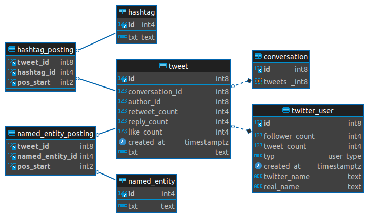

# Twitter Query Expansion
Reformulate a user query by enriching it with suitable expansion terms. Different word embedding models are applied such as FastText and Word2Vec. Elastic Search is used to find relevant tweets by using the reformulated user query.

**Contents**

[[_TOC_]]


## Project Description
In order to find relevant Tweets within a large collection, it is useful to expand the initial user query with suitable terms. These expansion terms are determined using the provided Pipeline which consists of:
1. Text Preprocessing  
2. Word Embedding
3. Elastic Search

The initial query is preprocessed using [SpaCy](https://spacy.io/). This first part of the pipeline includes the following steps:
- tokenize text
- remove stop-words
- detect entities
- determine Part-of-Speech (POS) tags
- mark hashtags
- mark Twitter users

For finding suitable expansions, different word embedding models are applied such as *FastText* and *Word2Vec*. To determine if an expansion term is suitable, the Point-wise Mutual Information (PMI) measure is performed, with respect to the co-occurrences of the initial query term and the expansion term. Finally, [Elastic Search](https://www.elastic.co/elasticsearch/) is used to obtain relevant tweets by using the reformulated user query.  

## Structure
In the root directory a `demo.ipynb` file is provided which demonstrates the use of the Pipeline. This includes downloading the embedding models as well as executing the Pipeline and describing different parameters. It is referred to this file for detailed information.  

The Pipeline itself is in the `pipeline` module folder, which contains the three main components e.g. `text_processor.py`, `embedding.py` and `elasticsearch.py`. Custom tokenizer and matcher for SpaCy's text processing are listed under `pipeline/tokenizer` and `pipeline/matcher` respectively. The Word Embeddings make use of downloaded models in the `models` directory. Have a look into the `templates` folder to inspect the files for generating an Elastic Search index and queries. 

In the `scripts` folder all executable files for working with this package are contained. The `model_loader.py` downloads a specified *Word2Vec* or *Fasttext* model and converts it into the expected format. For parsing Tweets from a PostgreSQL database into an ElasticSearch index, the `tweet_feeder.py` is utilized. It allows to filter Tweets to have some minimum number of words. The script `pipeline.py` handles the invocation of the full pipeline. 

## Setup
This project uses [pipenv](https://pipenv.pypa.io/en/latest/#install-pipenv-today). Make sure it is installed and run the following command in the root of this project

```sh
pipenv install
```

The Twitter data must be retrieved from a PostgreSQL database and parsed into an Elastic Search Index.
```sh
!python3 scripts/tweet_feeder.py -h
```
```sh
Feed Postgres data into Elastic Search Index

options:
  -h, --help            show this help message and exit
  -i INDEX, --index INDEX
                        Elastic Search index
  -t TABLE, --table TABLE
                        Postgres table
  -ec ELASTIC_CREDENTIALS, --elastic_credentials ELASTIC_CREDENTIALS
                        Path to Elastic Search credentials file
  -pc POSTGRES_CREDENTIALS, --postgres_credentials POSTGRES_CREDENTIALS
                        Path to Postgres credentials file
  -es ELASTIC_SETTINGS, --elastic_settings ELASTIC_SETTINGS
                        Settings for new Index; Look at "/templates/es-
                        config.conf"
  -wc WORDCOUNT, --wordcount WORDCOUNT
                        Minimum number of words per Tweet
```

## Twitter Dataset
The utilized data set was provided by the [Database Systems Research Group](https://dbs.ifi.uni-heidelberg.de/). It contains about 300,000 german Tweets over a period of about two years related to politics. 


<div align="center"><i>Twitter Database ER-Diagram</i></div>

## Word Embedding Models

**Word2Vec:**
[German Word2Vec Model](https://fasttext.cc/docs/en/crawl-vectors.html)

**Fasttext:**
[German Fasttext Model](https://devmount.github.io/GermanWordEmbeddings/)


## Elastic Search Index
To search Tweets performantly, an Elastic Search index is fed with data from the PostgreSQL database. Make sure to have access to a database and a running Elastic Search Cluster. The configurations of the Index are stated in `templates/es-config.tpl`. An example Tweet within an Index looks as follows:

```yaml
{
    "retweet_count": 30,
    "reply_count": 0,
    "like_count": 0,
    "created_at": "2021-09-01T15:04:20+02:00",
    "txt": "RT @THWLeitung: Seit sieben Wochen ist das #THW im Einsatz, um die Folgen der #Flutkatastrophe zu beseitigen. Dabei sind die Fähigkeiten aller THW-Fachgruppen gefordert. Bisher haben die 13.566 Einsatzkräfte des THW 1.530.000 Einsatzstunden geleistet. Foto: Kai-Uwe Wärner https://t.co/3N7xqdFb21",
    "hashtags": [
        "flutkatastrophe",
        "thw"
    ],
    "word_count": 38
}
```


## Results

### Limitations
- model vectors, no OOV

### Next Steps
- include named entities

